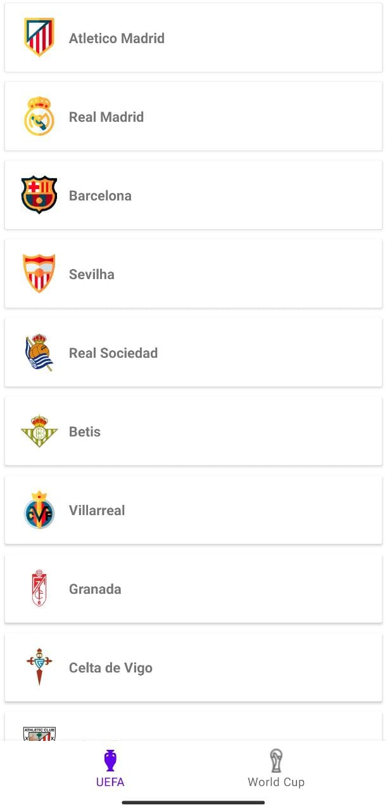
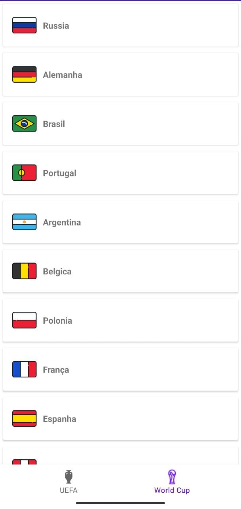
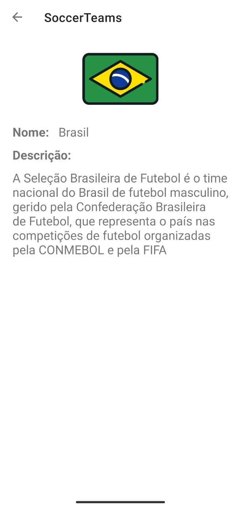

## Project to practice using BottomNavigationView, Fragment, Singleton and mock

#### What was used?

- RelativeLayout
- FrameLayout
- RecyclerView
- LinearLayout
- CardView
- ConstraintLayout
- AppCompatImageView
- TextView
- Toolbar
- ImageView

- BottomNavigationView
  - OnNavigationItemSelectedListener

- Fragment

- Singleton
- Mock

- data class
- ArrayList
- MutableList - mutableListOf
- inflater
- View
- LinearLayoutManager
- Adapter
- ViewHolder
- List

##### Implementation:

- io.coil-kt:coil:1.2.0

			 			   

---

##### Links:

- https://iconarchive.com
- https://www.flaticon.com

